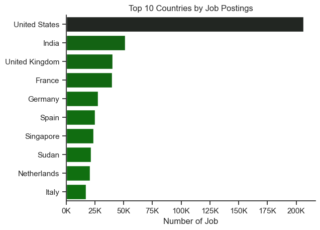
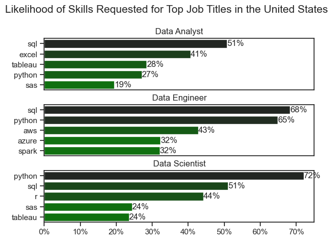
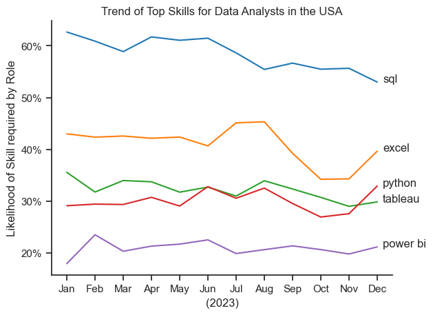
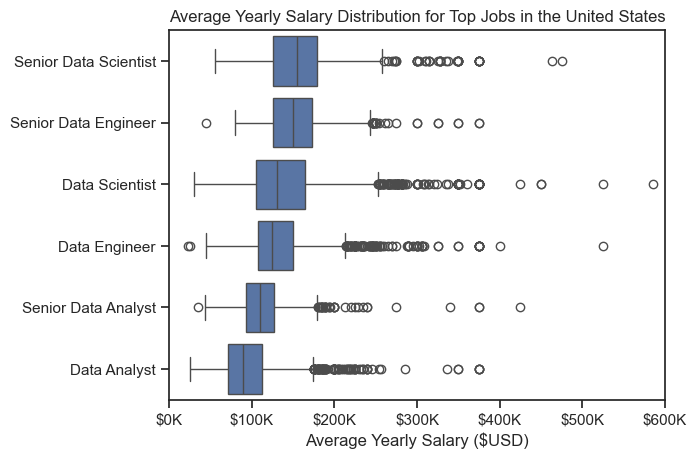
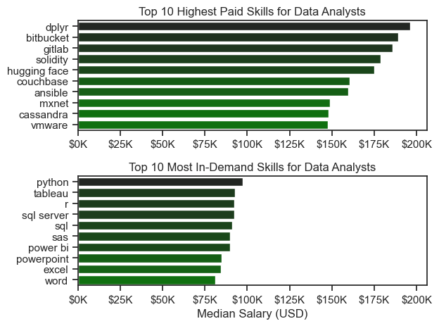
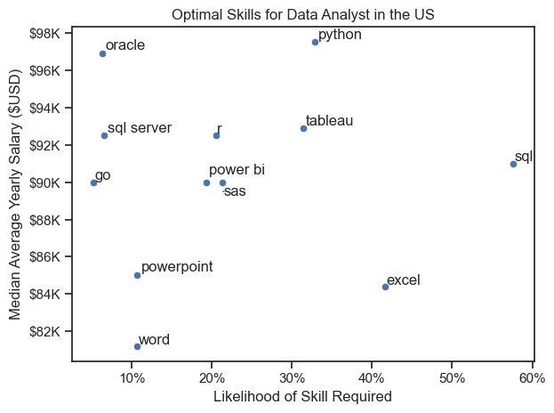
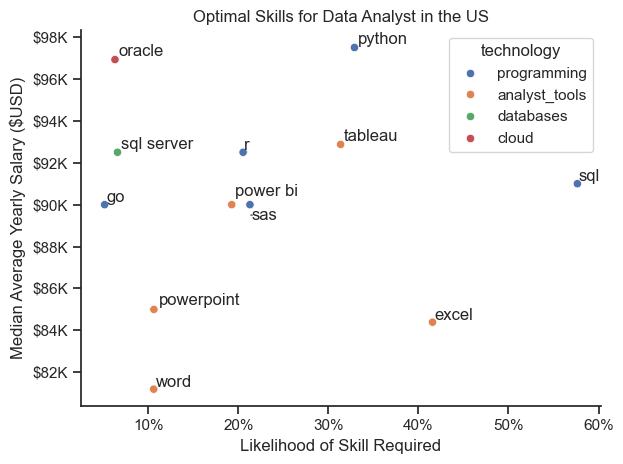

# Overview 

Welcome to my analysis of the data job market, focusing on data analyst roles in the United States. This project was born out of a desire to navigate and understand the job market more effectively using Python. It delves into the top-paying and in-demand skills to help find optimal job opportunities for data analysts.

The data is sourced from [Luke Barousse's Python Course](https://lukebarousse.com/python) which provides a foundation for my analysis. The data contains detailed information such as:
- job titles
- salary
- location and 
- essential skills for each role.  
Through a series of Python scripts, I explore key questions such as the most demanded skills, salary trends, and the intersection of demand and salary in data analytics.

# The Questions ❓

Using this project, I seek to answer the following questions:  
1. What are the skills most in demand for the top 3 most popular data roles?
2. How are in-demand skills trending for Data Analysts?
3. How well do jobs and skills pay for Data Analysts?
4. What are the optimal skills for data analysts to learn? (High Demand AND High Paying) 

# Tools Used 🛠️

For a deep dive into the dataset, I harnessed the power of several key tools such as:

- **Python  :** This tool was the backbone of my analysis, allowing me to analyze the data and find critical insights. The following Python libraries were utilised:
    - **Pandas Library:** This was used to analyze the data. 
    - **Matplotlib Library:** This was used to visualize the data.
    - **Seaborn Library:** Helped me create more advanced visuals. 
- **Visual Studio Code  :** My go-to IDE for writing and executing Python scripts.
- **Git & GitHub  :** Essential for version control, sharing my Python code and analysis, and ensuring collaboration and project tracking.

# Data Preparation and Cleanup 🛁

This section outlines the steps taken to prepare the data for analysis, ensuring accuracy and usability.

## Import & Clean Up Data

I start by importing necessary libraries and loading the dataset, followed by initial data cleaning tasks to ensure data quality.

```python
# Importing Libraries
import ast
import pandas as pd
import seaborn as sns
from datasets import load_dataset
import matplotlib.pyplot as plt  

# Loading Data
dataset = load_dataset('lukebarousse/data_jobs')
df = dataset['train'].to_pandas()

# Data Cleanup
df['job_posted_date'] = pd.to_datetime(df['job_posted_date'])  #to cast the date from string to datetime type
df['job_skills'] = df['job_skills'].apply(lambda x: ast.literal_eval(x) if pd.notna(x) else x)  #to cast the skills from a string list to a list

```

## Filter US Jobs

To focus my analysis on the U.S. job market, I apply filters to the dataset, narrowing down to roles based in the United States.
This was a data driven decision as the dataset contains more information about the USA job market.

```python
#to decide on which country to focus my analysis, I ploted top 10 countries
df_country = df['job_country'].value_counts().head(10).to_frame()

sns.barplot(data=df_country, x= 'count', y= 'job_country',hue= 'count', palette= 'dark:green_r', legend= False )
sns.despine()
ax= plt.gca()
ax.xaxis.set_major_formatter(plt.FuncFormatter(lambda x, pos: f"{int(x/1000)}K"))
plt.xlabel('Number of Job')
plt.ylabel('')
plt.title('Top 10 Countries by Job Postings')
plt.show()
```



```python
df_US = df[(df['job_country'] == 'United States')].copy()  #filter out the data for only the US market. This would be my final dataset

```

# Exploratory Data Analysis EDA 🔍

Exploring the dataset for the USA job market and Data Analyst roles only.  
This can be found here: [1_EDA](1_EDA.ipynb).

```python
df_DA_USA = df[(df['job_country'] == 'United States') & (df['job_title_short'] == 'Data Analyst')].copy()  #analysing only USA jobs as USA has the most jobs in the posting from below
```

```python
df_DA_USA.info()
```
| # | Column                    | Non-Null Count | Dtype              | 
|---|---------------------------|----------------|--------------------|
| 0 | job_title_short           | 67,816         | object             |
| 1 | job_title                 | 67,816         | object             |
| 2 | job_location              | 67,582         | object             | 
| 3 | job_via                   | 67,809         | object             | 
| 4 | job_schedule_type         | 67,107         | object             |
| 5 | job_work_from_home        | 67,816         | bool               |
| 6 | search_location           | 67,816         | object             |
| 7 | job_posted_date           | 67,816         | datetime64[ns]     |
| 8 | job_no_degree_mention     | 67,816         | bool               |
| 9 | job_health_insurance      | 67,816         | bool               |
| 10| job_country               | 67,816         | object             |
| 11| salary_rate               | 8,442          | object             |
| 12| salary_year_avg           | 4,350          | float64            |
| 13| salary_hour_avg           | 3,980          | float64            |
| 14| company_name              | 67,816         | object             |
| 15| job_skills                | 57,391         | object             |
| 16| job_type_skills           | 57,391         | object             |

- Total entries: 67,816
- Total columns: 17
- Memory usage: 8.0+ MB  


```python
df_DA_USA.describe()
```
|                  | Job Posted Date        | Salary Year Avg | Salary Hour Avg |
|------------------|------------------------|-----------------|-----------------|
| Count           | 67,816                 | 4,350           | 3,980           |
| Mean            | 2023-06-15 03:16:27    | $94,553.96      | $38.31          |
| Minimum         | 2023-01-01 00:00:04    | $25,000.00      | $8.00           |
| 25th Percentile | 2023-03-12 18:02:09    | $71,262.50      | $24.00          |
| Median (50%)    | 2023-06-11 18:49:23    | $90,000.00      | $33.00          |
| 75th Percentile | 2023-09-08 19:01:58    | $112,500.00     | $50.00          |
| Maximum         | 2023-12-31 23:31:54    | $375,000.00     | $391.00         |
| Standard Dev.   | N/A                    | $33,248.65      | $18.76          |


# The Analysis

Each notebook in this project file is aimed at investigating specific aspects of the data job market. Here’s how I approached each question:

## 1. What are the most demanded skills for the top 3 most popular data roles?

To find the most demanded skills for the top 3 most popular data roles. I filtered out those positions by which ones were the most popular, and got the top 5 skills for these top 3 roles. This query highlights the most popular job titles and their top skills, showing which skills should be focused on depending on the targeted role. 

View my notebook with detailed steps here: [2_Skill_Demand](2_Skills_count.ipynb).

### Visualize Data

```python
fig, ax = plt.subplots(len(top_titles), 1)
for i, job_title in enumerate(top_titles):
    df_plot = df_skills_percent[df_skills_percent['job_title_short'] == job_title].head()
    sns.barplot(df_plot, x= 'skill_percent', y= 'job_skills', ax= ax[i], hue= 'skill_percent', palette= 'dark:green_r', legend= False)
    ax[i].set_ylabel('')
    ax[i].set_xlabel('')
    ax[i].set_title(job_title)
    ax[i].xaxis.set_major_formatter(plt.FuncFormatter(lambda x, _: f'{int(x)}%'))
    ax[i].set_xlim(0, 75)
    if i != len(top_titles) - 1:
        ax[i].set_xticks([])

    for index, val in enumerate(df_plot['skill_percent']):
        ax[i].text(val, index, f'{val:.0f}%', va= 'center')
fig.suptitle('Likelihood of Skills Requested for Top Job Titles in the United States', fontsize= 15)
fig.tight_layout(h_pad= 0.5)
```

### Results


  
*Bar chart visualizing the skills required for the top 3 data roles in the USA*

### Insights:

- SQL is the most requested skill for Data Analysts and Data Engineers, as it is required in over half the job postings for both roles. For Data Scientists, Python is the most sought-after skill, appearing in 72% of job postings.
- Data Engineers require more specialized technical skills (AWS, Azure, Spark) compared to Data Analysts and Data Scientists who are expected to be proficient in more general data management and analysis tools (Excel, Tableau).
- Python is a versatile skill, highly demanded across all three roles, but most prominently for Data Scientists (72%) and Data Engineers (65%) with 27% of Data Analysts jobs requiring it.


## 2. How are in-demand skills trending for Data Analysts?

To determine how skills are trending in 2023 for Data Analyst position in the United states, I filtered the dataset toe only include data analyst positions in the United States, derived a month column and grouped the skills by the month of the job postings using a pivot table. Then I retrieved the top 5 skills by month.

Find detailed steps on my notebook here: [3_in_demand_skills_trend](3_in_demand_skills.ipynb).

### Visualize Data

```python
#plot
from matplotlib.ticker import PercentFormatter  
sns.lineplot(data= df_plot, dashes= False, palette= 'tab10', legend= False)
plt.title('Trend of Top Skills for Data Analysts in the USA')
plt.xlabel('(2023)')
plt.ylabel('Likelihood of Skill required by Role')
ax= plt.gca()
ax.yaxis.set_major_formatter(PercentFormatter(decimals= 0))
sns.despine()
for i in range(5):
    plt.text(11.2, df_plot.iloc[-1, i], df_plot.columns[i])
```

### Results

  
*Line chart visualizing the trend of top skills for data analysts in the US in 2023.*

### Insights:
- SQL remains the most consistently demanded skill throughout the year, although it shows a gradual decrease in demand from June.
- Excel experienced a significant increase in demand starting around October, surpassing both Python and Tableau by the end of the year.
- Both Python and Tableau show relatively stable demand throughout the year with some fluctuations but remain essential skills for data analysts with python exceeding demand for Tableau in November. 
- Power BI, while being lower in demand compared to the others, shows a slight upward trend towards the year's end.


## 3. How well do jobs and skills pay for Data Analysts?

To identify the highest-paying roles and skills in the United States, I filtered the dataset to only include job postings from the United states and visualized their median salary using a box plot.

Detailed steps and code can be found on my notebook here: [4_salary_analysis](4_salary_analysis.ipynb).

#### Visualize Data 

```python
sns.boxplot(data= df_US_top_6, x='salary_year_avg', y='job_title_short', order= df_median)

plt.title('Average Yearly Salary Distribution for Top Jobs in the United States')
plt.xlabel('Average Yearly Salary ($USD)')
plt.ylabel('')
ax = plt.gca()
ax.xaxis.set_major_formatter(plt.FuncFormatter(lambda x, pos: f"${int(x/1000)}K"))
plt.xlim(0, 600000)
plt.show()
```

#### Results

  
*Box plot visualizing the salary distributions for the top 6 data job titles.*

#### Insights

- Senior roles (Senior Data Scientist, Senior Data Engineer, Senior Data Analyst) generally have higher median salaries than their non-senior counterparts. However, Senior Data Analysts do not earn more than a Data Scientist or a Data Engineer.

- Senior Data Scientist positions tend to have the highest salary potential, with up to $600K, indicating the high value placed on advanced data skills and experience in the industry.

- Data Engineer and Data Scientist roles show a considerable number of outliers on the higher end of the salary spectrum, suggesting that exceptional skills or circumstances can lead to high pay in these roles. In contrast, Data Analyst roles demonstrate more consistency in salary, with fewer outliers.

- The median salaries increase with the seniority and specialization of the roles. Senior roles (Senior Data Scientist, Senior Data Engineer) not only have higher median salaries but also larger differences in typical salaries, reflecting greater variance in compensation as responsibilities increase.

### Highest Paid and In-Demanded Skills for Data Analysts

Next, I narrowed my analysis to focused only on data analyst roles. I visualized the highest-paid skills and the most in-demand skills using two bar charts.
Detailed steps and code can also be found here: [4_salary_analysis](4_salary_analysis.ipynb).

#### Visualize Data

```python

fig, ax = plt.subplots(2, 1)  

#Highest paid skills (top 10)
sns.barplot(data= df_DA_top_pay, x= 'median', y= df_DA_top_pay.index, ax=ax[0], hue= 'median', palette=  'dark:green_r', legend= False)
ax[0].set_title('Top 10 Highest Paid Skills for Data Analysts')
ax[0].set_ylabel('')
ax[0].set_xlabel('')
ax[0].xaxis.set_major_formatter(plt.FuncFormatter(lambda x, _: f'${int(x/1000)}K'))

#most in-demand skills (top 10)
sns.barplot(data= df_DA_popular_skill, x= 'median', y= df_DA_popular_skill.index, ax=ax[1], hue= 'median', palette= 'dark:green_r', legend= False)
ax[1].set_title('Top 10 Most In-Demand Skills for Data Analysts')
ax[1].set_ylabel('')
ax[1].set_xlabel('Median Salary (USD)')
ax[1].set_xlim(ax[0].get_xlim())  # Set the same x-axis limits as the first plot
ax[1].xaxis.set_major_formatter(plt.FuncFormatter(lambda x, _: f'${int(x/1000)}K'))

plt.tight_layout()
plt.show()

```

#### Results
Here's the breakdown of the highest-paid and in-demand skills for data analysts in the US:

  
*Bar charts visualizing the highest paid skills and in-demand skills for data analysts in the US.*

#### Insights:

- The top chart shows that the highest-paying skills (`dplyr`, `bitbucket`, `gitlab`, `solidity`) suggest that data analysts with software engineering/developer skills command premium salaries (potentially 150K−200K range)
The most demanded skills (`Python`, `Tableau`, `R`, `SQL`) represent traditional data analysis toolkit, suggesting these remain fundamental requirements

- The bottom chart shows that `Power BI`, `Tableau`, and even `PowerPoint` highlight the continued need for data visualization and business communication skills

- `Excel`, `Word`, and `PowerPoint` appearing together shows many analyst roles still operate heavily in Microsoft Office environments

- The most in-demand skills appear to offer lower median salaries (50K−100K range) compared to the niche technical skills

- There's a clear distinction between the skills that are highest paid and those that are most in-demand. Data analysts aiming to maximize their career potential should consider developing a diverse skill set that includes both high-paying specialized skills and widely demanded foundational skills.

## 4. What are the most optimal skills to learn for Data Analysts?
To identify the most optimal skills or Analysts to learn ( the ones that are the highest paid and highest in demand) I calculated the percent of skill demand and the median salary of these skills.

Detailed steps and be found here on my notebook: [5_Optimal_Skills](5_optimal_skills.ipynb).

#### Visualize Data

```python
from adjustText import adjust_text #install adjustText
from matplotlib.ticker import PercentFormatter  #to format ticker to percentage

#df_DA_high_demand_skills.plot(kind= 'scatter', x= 'skill_count', y= 'median_salary')
sns.scatterplot(df_DA_high_demand_skills, x= 'skill_percent', y= 'median_salary')

texts= []

for i, txt in enumerate(df_DA_high_demand_skills.index):
    x, y = df_DA_high_demand_skills['skill_percent'].iloc[i], df_DA_high_demand_skills['median_salary'].iloc[i]

    # Manually adjusting the labels for power bi and sas as their percentages are overlapping on the chart
    if txt == "power bi":
        x -= 0.01  # Move it slightly to the right
        y += 500   # Move it slightly up
    elif txt == "sas":
        x -= 0.01  # Move it slightly to the left
        y -= 500   # Move it slightly down

    texts.append(plt.text(x, y, txt))
adjust_text(texts, arrowprops= dict(arrowstyle= "->", color= 'gray', lw=1))
ax= plt.gca()
ax.yaxis.set_major_formatter(plt.FuncFormatter(lambda y, pos: f"${int(y/1000)}K"))
ax.xaxis.set_major_formatter(PercentFormatter(decimals= 0))

plt.xlabel('Likelihood of Skill Required')
plt.ylabel('Median Average Yearly Salary ($USD)')
plt.title('Optimal Skills for Data Analyst in the US')
plt.tight_layout()
#LINEWIDTH, linestyle, colormap, markers, markersize, figsize
plt.show()
```

#### Results

    
*A scatter plot visualizing the most optimal skills (high paying & high demand) for data analysts in the US.*

#### Insights:

- The skill `Oracle` appears to have the highest median salary of nearly $97K, despite being less common in job postings. This suggests a high value placed on specialized database skills within the data analyst profession.

- More commonly required skills like `Excel` and `SQL` have a large presence in job listings but lower median salaries compared to specialized skills like `Python` and `Tableau`, which not only have higher salaries but are also moderately prevalent in job listings.

- Skills such as `Python`, `Tableau`, and `SQL Server` are towards the higher end of the salary spectrum while also being fairly common in job listings, indicating that proficiency in these tools can lead to good opportunities in data analytics.

##### Key Takeaways for a Data Analyst Career Path:
- SQL and Excel are must-have foundational skills due to their high demand.
- Python and Tableau add more value by providing better salary opportunities.
- Niche skills like Oracle and SQL Server might be useful for specialized roles but are less common.
- Power BI and SAS have similar demand and salaries, making them interchangeable depending on company needs.

### Visualizing Different Techonologies

I added color coding to differentiate the skills based on technology (e.g., {Programming: Python})

#### Visualize Data

```python
from adjustText import adjust_text #install adjustText
from matplotlib.ticker import PercentFormatter  #to format ticker to percentage

#df_DA_high_demand_skills.plot(kind= 'scatter', x= 'skill_count', y= 'median_salary')
sns.scatterplot(df_plot, x= 'skill_percent', y= 'median_salary', hue= 'technology')

texts= []

for i, txt in enumerate(df_DA_high_demand_skills.index):
    x, y = df_DA_high_demand_skills['skill_percent'].iloc[i], df_DA_high_demand_skills['median_salary'].iloc[i]

    # Manually adjusting the labels for power bi and sas as their percentages are overlapping on the chart
    if txt == "power bi":
        x -= 0.01  # Move it slightly to the right
        y += 500   # Move it slightly up
    elif txt == "sas":
        x -= 0.01  # Move it slightly to the left
        y -= 500   # Move it slightly down

    texts.append(plt.text(x, y, txt))
adjust_text(texts, arrowprops= dict(arrowstyle= "->", color= 'gray', lw=1))
ax= plt.gca()
ax.yaxis.set_major_formatter(plt.FuncFormatter(lambda y, pos: f"${int(y/1000)}K"))
ax.xaxis.set_major_formatter(PercentFormatter(decimals= 0))

plt.xlabel('Likelihood of Skill Required')
plt.ylabel('Median Average Yearly Salary ($USD)')
plt.title('Optimal Skills for Data Analyst in the US')
plt.tight_layout()
sns.despine()
#LINEWIDTH, linestyle, colormap, markers, markersize, figsize
plt.show()
```

#### Results

  
*A scatter plot visualizing the most optimal skills (high paying & high demand) for data analysts in the US with color labels for technology.*

#### Insights:

- Most of the `programming` skills (colored blue) tend to cluster at higher salary levels compared to other categories, indicating that programming expertise might offer greater salary benefits.

- Database skills (colored orange), such as `Oracle` and `SQL Server`, are associated with some of the highest salaries, indicateing a significant demand for data management and manipulation expertise.

- Analyst tools (colored green), including `Tableau` and `Power BI`, are prevalent in job postings and offer competitive salaries, indicating that visualization and data analysis software are crucial for Data Analysts.

# What I Learned

This project deepened my understanding of the data analyst job market and enhanced my technical skills in Python for Data Analysis, especially in data manipulation and visualization. Here are a few specific takeaways for me:

- **Advanced Python Usage**: Utilizing libraries such as Pandas for data manipulation, Seaborn and Matplotlib for data visualization, and other libraries helped me perform complex data analysis tasks more efficiently.
- **Data Cleaning Importance**: I learned that thorough data cleaning and preparation are crucial before any analysis can be conducted as this ensures the accuracy of insights derived from the data.
- **Strategic Skill Analysis**: The project emphasized the importance of aligning one's skills with market demand. Understanding the relationship between skill demand, salary, and job availability allows for more strategic career planning in the tech industry. It also further butressed the importance of data driven decision making.


# Insights

This project provided several general insights into the data job market for analysts:

- **Skill Demand and Salary Correlation**: There is a clear correlation between the demand for specific skills, and the salaries these skills command. Advanced and specialized skills like Python and Oracle often lead to higher salaries.
- **Market Trends**: There are changing trends in skill demand, highlighting the dynamic nature of the data job market. Keeping up with these trends is essential for career growth in data analytics.
- **Economic Value of Skills**: Understanding which skills are both in-demand and well-compensated can guide data analysts in prioritizing learning to maximize their economic returns.


# Challenges I Faced

This project was not without its challenges, but it provided good learning opportunities:

- **Data Inconsistencies**: Handling missing or inconsistent data entries requires careful consideration and thorough data-cleaning techniques to ensure the integrity of the analysis.
- **Complex Data Visualization**: Designing effective visual representations of complex datasets was challenging but critical for conveying insights clearly and compellingly.
- **Balancing Breadth and Depth**: Deciding how deeply to dive into each analysis while maintaining a broad overview of the data landscape required constant balancing to ensure comprehensive coverage without getting lost in details.


# Conclusion

This exploration into the data analyst job market has been incredibly informative, highlighting the critical skills and trends that shape this evolving field. The insights gained enhance my understanding and provide actionable guidance for anyone looking to advance their career in data analytics. As the market continues to change, ongoing analysis will be essential to stay ahead in data analytics. This project is a good foundation for future explorations and underscores the importance of continuous learning and adaptation in the data field.